# 🧠 Algorithmic Pattern Memory Maps & Decision Trees

> **The 15-Second Problem Classifier**: Use these mental decision trees and memory maps to instantly identify the optimal pattern, data structure, and complexity for any MNC coding problem.

---

## 🗺️ 1. Master Algorithmic Decision Tree

When reading any problem, trace your path through this flowchart:

```mermaid
flowchart TD
    Start([Problem Statement]) --> InputType{What is the input structure?}

    %% Array / String Branch
    InputType -->|Array / String| ArrQ{What is the goal?}
    ArrQ -->|Contiguous Subarray / Substring| WinQ{Window constraint?}
    WinQ -->|Fixed Size K| FixedSW[Pattern: Fixed Sliding Window]
    WinQ -->|Dynamic / At most K / Longest| DynSW[Pattern: Dynamic Sliding Window]
    
    ArrQ -->|Pairs / Triplets / Sorted| TwoPtrQ{Is array sorted?}
    TwoPtrQ -->|Yes / Can sort without losing order| TwoPtr[Pattern: Two Pointers]
    TwoPtrQ -->|No / Must preserve original index| HashMap[Pattern: Hash Map / Frequency Table]

    ArrQ -->|Next Greater / Smaller Element / Spans| MonoStack[Pattern: Monotonic Stack]
    ArrQ -->|Range Queries / Updates| RangeQ{Static or Dynamic?}
    RangeQ -->|Static| PrefSum[Pattern: Prefix Sums / Difference Array]
    RangeQ -->|Dynamic Point/Range Updates| SegTree[Pattern: Segment Tree / Fenwick Tree]

    %% Optimization Branch
    InputType -->|Min/Max Optimization| OptQ{Can we test if answer X is valid?}
    OptQ -->|Yes, Monotonic Predicate holds| BSAnswer[Pattern: Binary Search on Answer]
    OptQ -->|No, Greedy choice is locally optimal| Greedy[Pattern: Greedy Algorithm]
    OptQ -->|No, Overlapping Subproblems & State| DP[Pattern: Dynamic Programming]
    OptQ -->|Top-K / Running Extremes| Heap[Pattern: Min/Max Heap]

    %% Tree / Graph Branch
    InputType -->|Tree / Hierarchy| TreeQ{Tree Property?}
    TreeQ -->|Level by Level| TreeBFS[Pattern: BFS Queue]
    TreeQ -->|Ancestry / Subtree / Paths| TreeDFS[Pattern: Post-order / DFS + LCA]
    TreeQ -->|Prefix Matching / Words| Trie[Pattern: Trie / Prefix Tree]

    InputType -->|Graph / Grid| GraphQ{What type of problem?}
    GraphQ -->|Shortest Path Unweighted| GraphBFS[Pattern: BFS Queue]
    GraphQ -->|Shortest Path Weighted >= 0| Dijkstra[Pattern: Dijkstra Priority Queue]
    GraphQ -->|Prerequisites / Ordering| TopoSort[Pattern: Kahn's TopoSort Indegree]
    GraphQ -->|Connected Components / Dynamic Edges| DSU[Pattern: Disjoint Set Union DSU]
    GraphQ -->|Bridges / Critical Links| Tarjan[Pattern: Tarjan's Low-Link DFS]

    %% Small N Branch
    InputType -->|Small Constraints N <= 20| SubsetsQ{Find all configurations?}
    SubsetsQ -->|Yes, permutations/combinations| Backtrack[Pattern: Recursion & Backtracking]
    SubsetsQ -->|Optimal cost covering all states| BitmaskDP[Pattern: Bitmask DP]
```

---

## ⚡ 2. The Input Constraint $\implies$ Time Complexity Memory Map

Interview constraints reveal the intended algorithm Big-$O$:

| Input Size ($N$) | Target Time Complexity | Likely Patterns / Algorithms |
| :--- | :--- | :--- |
| **$N \le 10$** | $O(N!)$ | Permutations, Travelling Salesman Brute-Force |
| **$N \le 20$** | $O(2^N)$ | Subsets, Backtracking, Meet-in-the-Middle, Bitmask DP |
| **$N \le 500$** | $O(N^3)$ | Floyd-Warshall, Matrix Multiplication, 3D/Interval DP |
| **$N \le 5,000$** | $O(N^2)$ | 2D DP, Nested loops, All pairs check, Graph Adjacency Matrix |
| **$N \le 10^5$ to $10^6$** | $O(N \log N)$ or $O(N)$ | **MNC Sweet Spot**: Sorting, Binary Search, Sliding Window, Monotonic Stack, BFS/DFS, Heaps, HashMaps, DSU, Segment Trees |
| **$N \le 10^9$ to $10^{18}$** | $O(\log N)$ or $O(\sqrt{N})$ or $O(1)$ | Binary Search on Answer, Fast Exponentiation, Prime Factorization, Math, Bit Manipulation |

---

## 🧩 3. Data Structure Mental Map (When to use What in C++)

| Data Structure | C++ STL Container | Best Used For | Pitfalls / Gotchas |
| :--- | :--- | :--- | :--- |
| **Hash Map** | `std::unordered_map<K, V>` | $O(1)$ lookup, frequency counts, complement pairs | $O(N)$ worst-case on hash collisions (custom hash for pairs/CP) |
| **Ordered Map** | `std::map<K, V>` | $O(\log N)$ lookup, maintaining sorted keys, `lower_bound` | Slower than hash map for pure lookup |
| **Min/Max Heap** | `std::priority_queue<T>` | Top-$K$ elements, running median, Dijkstra | Default is Max-Heap. Use `greater<T>` for Min-Heap |
| **Monotonic Stack** | `std::stack<int>` / `std::vector<int>` | Next Greater/Smaller Element, Histograms, Spans | Always store **indices**, not values |
| **Monotonic Deque** | `std::deque<int>` | Sliding window maximum/minimum in $O(1)$ per step | Evict from back when invariant breaks; evict from front when out of window |
| **Disjoint Set Union** | Custom Struct (`parent`, `rank`) | Dynamic connectivity, Kruskal's MST, cycle detection | Must implement both **Path Compression** and **Union by Rank** for $O(\alpha(N))$ |
| **Trie** | Custom Node (`child[26]`, `isEnd`) | Prefix search, autocomplete, bitwise Max-XOR | Memory overhead: allocate dynamically or via flat pool |
| **Segment Tree** | `std::vector<T>` size $4N$ | Range queries + Point/Range updates | Use 1-indexed or 0-indexed consistently; add Lazy array for range updates |

---

## 🎯 4. Pattern Recognition Triggers (Keyword $\implies$ Strategy)

| Problem Clue / Phrase | Immediate Pattern Trigger |
| :--- | :--- |
| *"Contiguous subarray with sum / condition..."* | **Sliding Window** or **Prefix Sum + Hash Map** (if negative numbers exist) |
| *"Find pair / triplet summing to target..."* | **Hash Map** (unsorted, return indices) or **Two Pointers** (sorted) |
| *"Next greater element / Stock span / Largest rectangle..."* | **Monotonic Stack** (storing indices) |
| *"Minimize the maximum..."* or *"Find the smallest $X$ such that..."* | **Binary Search on Answer** (Monotonic boolean predicate) |
| *"Schedule tasks / Interval overlap / Meeting rooms..."* | **Sorting by Start/End Time + Min-Heap or Sweepline** |
| *"Find shortest path in unweighted maze/grid..."* | **BFS with Queue** (first time reaching destination is guaranteed shortest) |
| *"Course prerequisites / Build order / Topological order..."* | **Kahn's Algorithm (BFS + In-Degree Array)** |
| *"Count number of ways / Maximize value with choices..."* | **Dynamic Programming** |
| *"Generate all valid combinations / permutations..."* | **Backtracking** (Template: Choose $\to$ Explore $\to$ Unchoose) |
| *"Merge streams / Top K frequent elements..."* | **Min-Heap of size $K$** |
