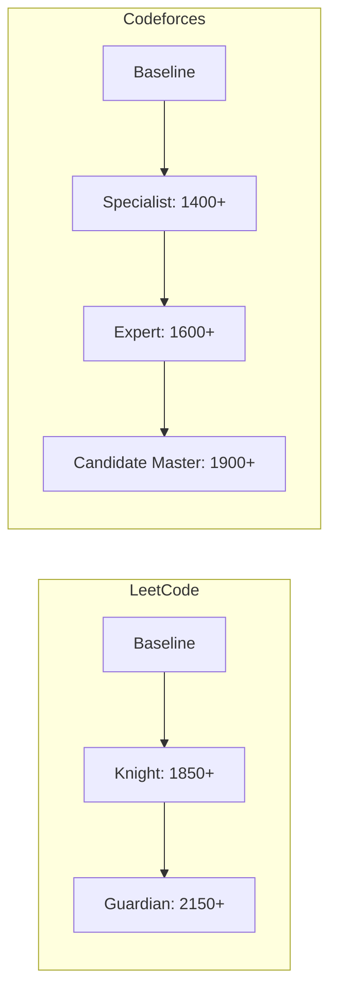

# 👤 Personal Profile & Competitive Programming Goals

> **Engineer**: Nithin Pathikonda  
> **Mission**: Reach **Guardian (2150+ Rating)** on LeetCode & **Candidate Master (1900+ Rating)** on Codeforces, while crushing Tier-1 MNC interviews.

---

## 🏆 Rating Milestones & Progress

| Platform | Handle / Profile | Current Rating | Target Milestone 1 | Target Milestone 2 (Final) | Status |
| :--- | :--- | :---: | :---: | :---: | :---: |
| **LeetCode** | *[Add LC Handle]* | Baseline | **Knight (1850+)** | **Guardian (2150+)** | ⏳ In Progress |
| **Codeforces** | *[Add CF Handle]* | Baseline | **Expert (1600+)** | **Candidate Master (1900+)** | ⏳ In Progress |

---

## 📅 Mandatory Weekly Contest Rhythm

Consistency in live contests is the only way to climb the rating ladder:

| Day & Time (IST) | Platform | Contest | Focus / Goal |
| :--- | :--- | :--- | :--- |
| **Saturday 8:00 PM** | LeetCode | **Biweekly Contest** | Target 3/4 under 45 mins $\to$ Push for 4/4 |
| **Sunday 8:00 AM** | LeetCode | **Weekly Contest** | Target 3/4 under 45 mins $\to$ Push for 4/4 |
| **Variable (Weekly)** | Codeforces | **Div 2 / Div 3 Round** | Fast A & B ($< 15$m, 0 penalty), solve C |

---

## 🧠 Personal Weakness & Leak Checklist
*(Check off as you plug knowledge leaks)*
- [ ] Speed on LeetCode Q1/Q2 (Must be $< 10$ minutes with 0 WAs).
- [ ] Codeforces ad-hoc / constructive logic (Div 2 B/C).
- [ ] Dynamic Programming transitions under contest pressure.
- [ ] Graph shortest path modeling (Dijkstra vs 0-1 BFS vs BFS).
- [ ] Binary Search on Answer predicate functions.
