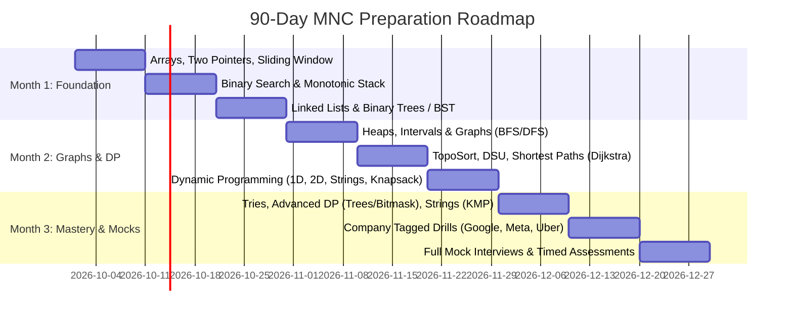

# 🗓️ 90-Day MNC Sprint Timeline & Spaced Repetition Engine

> **Target**: Crack Tier-1 MNCs (Google, Meta, Microsoft, Amazon, Uber, Apple) in 90 Days.  
> **Retention Strategy**: Automated R1 (Day +3) ➔ R2 (Day +10) ➔ R3 (Day +30) Spaced Repetition.

---

## ⏳ 90-Day (12-Week) Master Milestone Calendar



### 📅 Phase Breakdown

| Phase | Weeks | Core Focus Areas | Target Problems |
| :--- | :--- | :--- | :---: |
| **Phase 1: Linear & Hierarchical** | **Weeks 1–4** | Arrays, Sliding Window, Binary Search, Monotonic Stack, Linked Lists, Trees & BST | 60 |
| **Phase 2: Optimization & Graphs** | **Weeks 5–8** | Heaps, Intervals, Graph Traversals, TopoSort, DSU, Dijkstra, Dynamic Programming (1D/2D/Strings/Knapsack) | 75 |
| **Phase 3: Advanced & Company Tagged** | **Weeks 9–12** | Advanced DP, Tries, Advanced Strings (KMP), Segment Trees, Google/Meta Tagged, 45-min Timed Mock Interviews | 65 |
| **Total** | **12 Weeks** | **Complete High-Yield MNC Problem Bank** | **200** |

---

## ⏰ The Daily 2.5-Hour High-Yield Routine

To prevent burnout and guarantee maximum retention, split your daily session into 3 blocks:

```
┌────────────────────────────────────────────────────────────────────────┐
│ 1. [20 Mins] Spaced Repetition (Review 2 previous problems from R-Queue)│
├────────────────────────────────────────────────────────────────────────┤
│ 2. [90 Mins] New Problem Solving (2 problems: Deep Dive + Clean C++20) │
├────────────────────────────────────────────────────────────────────────┤
│ 3. [20 Mins] Logging & Post-Mortem (Update TRACKER.md + ERROR_LOG.md)  │
└────────────────────────────────────────────────────────────────────────┘
```

---

## 🔁 Active Spaced Repetition Queue

> **How to use**: When you solve a problem, log it below with today's date. Mark R1 (+3 days), R2 (+10 days), and R3 (+30 days).

| # | Problem Name | Topic | Solved Date | R1 (+3 Days)<br>Mental Recall | R2 (+10 Days)<br>Cold Re-code | R3 (+30 Days)<br>Hard Variant | Confidence (🟢/🟡/🔴) |
|---|---|---|:---:|:---:|:---:|:---:|:---:|
| 001 | [LC 1: Two Sum](01_arrays_hashing/lc_0001_two_sum.cpp) | 01_arrays_hashing | Day 1 | 📅 Due Day 4 | ⏳ Day 11 | ⏳ Day 31 | 🟢 Solid (O(N)) |
| 002 | [LC 121: Best Time to Buy & Sell Stock](01_arrays_hashing/lc_0121_best_time_to_buy_and_sell_stock.cpp) | 01_arrays_hashing | Day 1 | 📅 Due Day 4 | ⏳ Day 11 | ⏳ Day 31 | 🟢 Solid (O(N)) |
| 003 | [LC 242: Valid Anagram](01_arrays_hashing/lc_0242_valid_anagram.cpp) | 01_arrays_hashing | Day 1 | 📅 Due Day 4 | ⏳ Day 11 | ⏳ Day 31 | 🟢 Solid (O(N)) |
| 004 | [LC 49: Group Anagrams](01_arrays_hashing/lc_0049_group_anagrams.cpp) | 01_arrays_hashing | Day 1 | 📅 Due Day 4 | ⏳ Day 11 | ⏳ Day 31 | 🟢 Solid (O(N*K log K)) |
| 005 | [LC 347: Top K Frequent Elements](01_arrays_hashing/lc_0347_top_k_frequent_elements.cpp) | 01_arrays_hashing | Day 2 | 📅 Due Day 5 | ⏳ Day 12 | ⏳ Day 32 | 🟢 Solid (O(N)) |
| 006 | [LC 238: Product of Array Except Self](01_arrays_hashing/lc_0238_product_of_array_except_self.cpp) | 01_arrays_hashing | Day 2 | 📅 Due Day 5 | ⏳ Day 12 | ⏳ Day 32 | 🟢 Solid (O(N) time, O(1) space) |

---

## 🎯 Weekly Revision Rules
1. **Never skip R1**: If you can't recall the trigger clue in 5 minutes on Day 3, demote the problem back to Day 0.
2. **Cold Re-coding on R2**: Do NOT look at your old solution. Open an empty `.cpp` file and code it with a 15-minute stopwatch.
3. **If you fail any test case**: Immediately record the root cause in [`learnings_and_error_logs/ERROR_LOG.md`](learnings_and_error_logs/ERROR_LOG.md).
